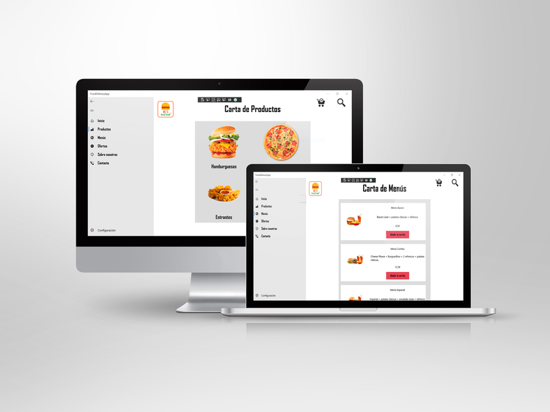

# FAST FOOD DELIVERY APP🍔🍕🍟🌭

_Proyecto realizado para la asignatura de **Interacción Persona-Ordenador 2** en el que se ha desarrollado una aplicación UWP consistente en una **Aplicación de compra de comida rápida** con distintas funcionalidades como un catálogo de productos, visualización de información adicional y carro de
la compra._

## Construido con 🛠️

_Herramientas y lenguajes utilizados:_

* Visual Studio 
* Blend for Visual Studio 
* UWP
* C#

## Autores ✒️

_Dicho proyecto ha sido elaborado por:_
* **Laura Muñoz Jávega**
* **Miguel Pellicer Domínguez**

